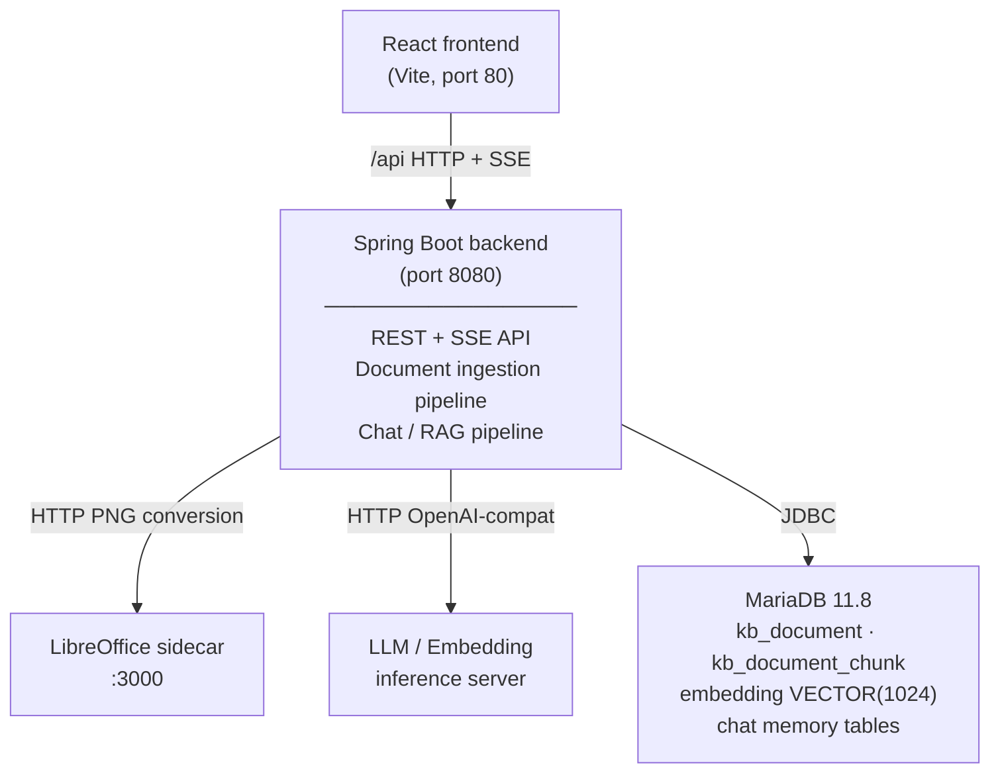
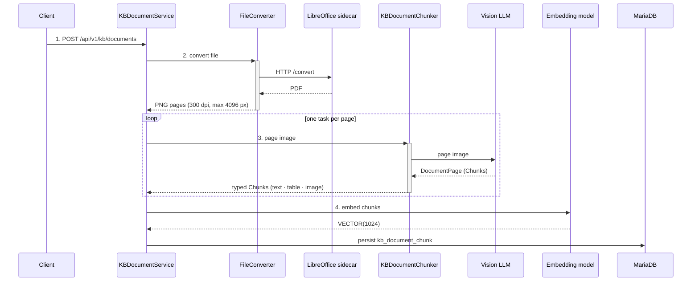
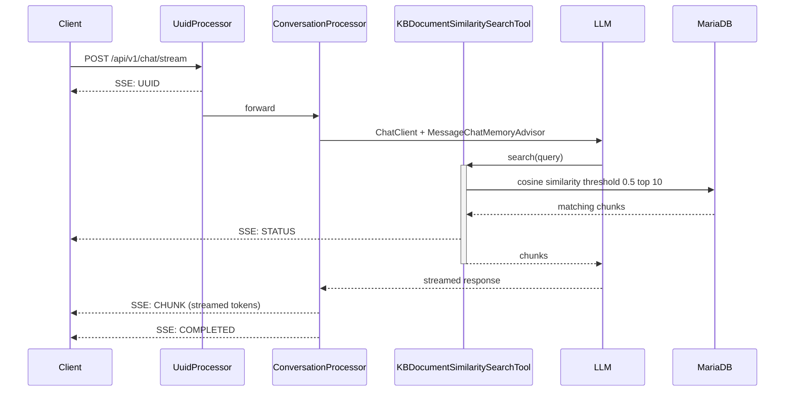

# Architecture

Cosmo42 is a Spring Boot 4 application that exposes a REST + SSE API for a RAG workflow. A React 19 single-page app talks to it. Inference is delegated to any OpenAI-compatible HTTP server. Persistence and vector search live in MariaDB.

## High-level component map



## Document ingestion pipeline

`KBDocumentService` → `KBDocumentChunker` → `FileConverter`



1. Client uploads a file via `POST /api/v1/kb/documents` (multipart, PDF / DOCX / XLSX).
2. `FileConverter` calls the LibreOffice sidecar at `${cosmo42.libreoffice.base-url}/convert` to normalize non-PDF inputs to PDF, then renders each page to a grayscale PNG at 300 dpi (longest side capped at 4096 px).
3. `KBDocumentChunker` dispatches one task per page on a fixed thread pool (size `cosmo42.chunking.pool.size`). Each task sends the page image to the vision LLM and parses the structured `DocumentPage` response into typed `Chunk`s:
   - `text` chunks (plain prose)
   - `table` chunks (preserved as structured markup)
   - `image` chunks (figure descriptions)
   Cross-page cut-off chunks are merged.
4. Each chunk is embedded via the embedding model and persisted in `kb_document_chunk.embedding` (MariaDB `VECTOR(1024)`).
5. The ingestion executor (`cosmo42.ingestion.executor.*`) coordinates retries and recovery (`cosmo42.ingestion.recovery.interval-ms`, `max-page-attempts`, `page-chunking-timeout-seconds`).

The document status progresses through `pending → loading → loaded` (with `failed` on terminal error).

## Chat pipeline

`ChatService` → `ConversationProcessor` → `KBDocumentSimilaritySearchTool`



1. Client calls `POST /api/v1/chat/stream`. The response is `Flux<ServerSentEvent<ChatResponseDTO>>`.
2. `UuidProcessor` is the first stage: it emits a `UUID` event carrying the conversation UUID (newly minted or echoed from the request) before any LLM call. The frontend uses this to pin the conversation in its sidebar immediately.
3. `ConversationProcessor` invokes Spring AI's `ChatClient`, configured with:
   - `MessageChatMemoryAdvisor` — JDBC-backed memory, sliding window configurable via `cosmo42.chat.memory.max-messages` (default 25).
   - `KBDocumentSimilaritySearchTool` — exposed as a callable tool to the LLM.
4. When the LLM decides to retrieve context, it calls `KBDocumentSimilaritySearchTool.search(query)`. The tool:
   - Embeds the query with the embedding model.
   - Runs cosine similarity over `kb_document_chunk.embedding` (threshold `0.5`, top `10`).
   - Emits a `STATUS` SSE event via the `ToolContext` sink so the UI can show "searching the knowledge base...".
   - Returns the matching chunks to the model.
5. The LLM streams its answer; each token batch is emitted as a `CHUNK` event. When the stream ends, a final `COMPLETED` event is sent.

## SSE event types

Defined in `ChatEventType`:

| Type        | Payload                              | When                                 |
|-------------|--------------------------------------|--------------------------------------|
| `UUID`      | conversation UUID (string)           | First event of every stream          |
| `STATUS`    | human-readable status message        | While the search tool is running     |
| `CHUNK`     | partial assistant text               | Each LLM token batch                 |
| `COMPLETED` | empty                                | End of stream                        |

## Persistence

- **MariaDB 11.8+** is required — Cosmo42 relies on the `VECTOR` column type.
- Schema is managed by Flyway; migrations live in `backend/src/main/resources/db/migrations/`.
- `kb_document_chunk.embedding` is `VECTOR(1024)`. The dimension is hard-wired to the default embedding model (`BAAI/bge-m3`). Changing the embedding model to one with a different output dimension requires a Flyway migration and a re-embedding of all documents.
- Chat memory is persisted by Spring AI's JDBC chat-memory repository (`spring.ai.chat.memory.repository.jdbc.*`).

## LibreOffice sidecar

LibreOffice is not thread-safe in headless mode, so it runs as a single-threaded HTTP service in its own container (`docker/libreoffice/`, Python 3 + `libreoffice --headless`). A process-level lock serializes conversion requests. The image is built automatically by Docker Compose on first `up`.

## Inference

The backend talks to two OpenAI-compatible HTTP endpoints:

- **Chat completions** at `${spring.ai.openai.base-url}` (path `/chat/completions`).
- **Embeddings** at `${spring.ai.openai.embedding.base-url}` (path configurable via `spring.ai.openai.embedding.embeddings-path`).

Any server implementing the OpenAI API will work: vLLM, llama.cpp server, Ollama, LM Studio, text-embeddings-inference (TEI), etc. See [MODELS.md](MODELS.md).

## Module layout

```
backend/
  src/main/java/.../kb/          # ingestion, storage, chunking
  src/main/java/.../chat/        # chat service, processors, tool
  src/main/java/.../config/      # Spring AI + security + datasource config
  src/main/resources/
    application.properties
    db/migrations/               # Flyway
frontend/
  src/                           # React 19 + Vite + TypeScript
docker/
  docker-compose.yml             # full stack (mariadb + libreoffice + backend + frontend)
  docker-compose-no-webapp.yml   # dev: mariadb + libreoffice only
  libreoffice/                   # sidecar image
docs/                            # this folder
usage_scripts/                   # curl helpers (kb_upload.sh, chat.sh)
```
